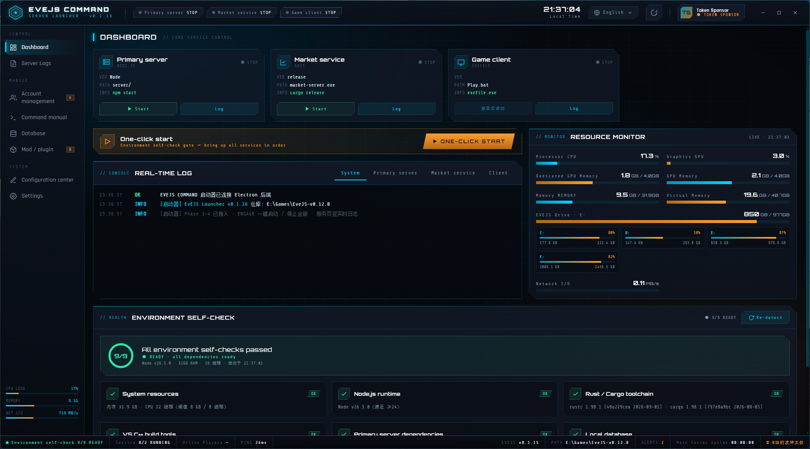
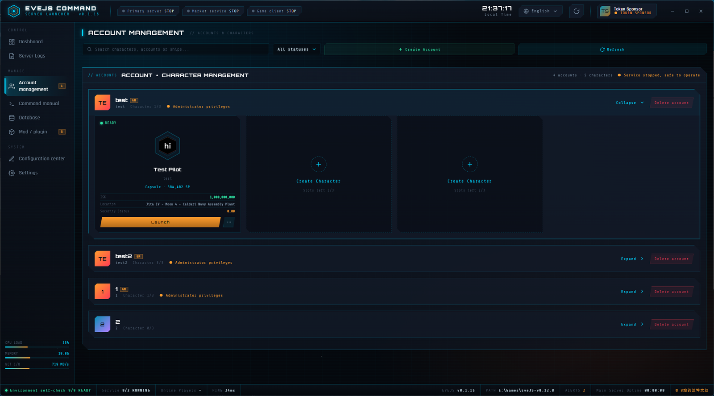
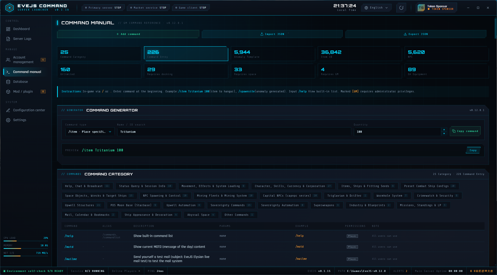
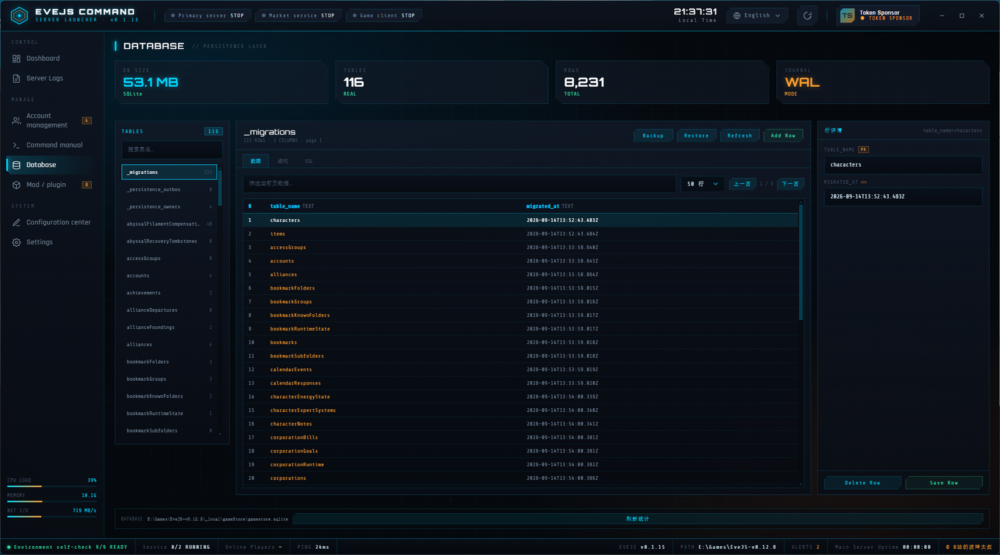
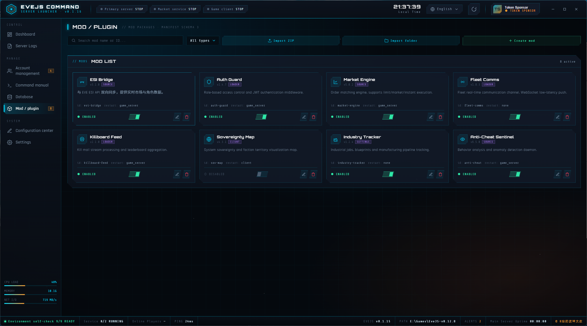

# EvEJS Launcher / EvEJS 启动器

An EVE Online Neocom-style all-in-one launcher for EvEJS: services, logs, accounts, database and the mod ecosystem.
EVE Online Neocom 风格的一站式启动器：管服务、看日志、管账号、改数据库、做模组。

**English** ｜ [中文](#中文)

- Download: [Latest Release](https://github.com/diguo520/EVEjs-launcher/releases/latest)
- MOD Making Tutorial：[Wiki](https://github.com/diguo520/EVEjs-launcher/wiki).

---

## English

### What is this

`EvEJS Launcher` is the graphical launcher for a standalone EvEJS server (Electron, Windows portable exe, no installation). It folds everything that used to be done with shell commands, config edits and log tailing into one EVE-styled UI: start/stop the main server and market service, watch server logs live, manage accounts and characters, browse and edit the SQLite database, look up commands, and run a **complete mod ecosystem** (identity -> create -> submit -> market -> moderation).

### Features

#### Control deck
- **One-click start brings up only the main server + market service**; the game client is launched on demand from Account management -> character Login (no extra start button)
- Per-service start/stop, status pills, crash/error surfacing
- Resource monitoring: CPU, memory, **GPU utilisation / dedicated GPU memory / shared GPU memory**, **virtual memory**, network I/O and **per-volume disk usage** (the volume holding EvEJS is marked)
- Status bar: online players (from the server), main-server uptime (`--:--:--` while stopped), environment self-check progress, ALERTS count and local time

#### Server logs
- Reads `server/logs/server.log` (UTF-8, last 5000 lines) — no command input needed
- Live stream with module filters (system / main server / market service / client) and level filters (All / INFO / WARN / ERROR)
- Colouring: IPs, ports and `[process exit] exit code` are highlighted; **ERR / WARN tint the whole line**
- Auto-scrolls to the newest line, but **never yanks you back while you are reading older entries** (follow resumes at the bottom)
- Mod load lines in the system log carry a coloured `MOD` badge (amber when the mod is skipped/disabled)

#### Accounts and characters
- Create accounts (optionally **granting GM rights**), show ban status
- Character portraits and details: ISK, skill points (SP), ship, location, security status
- **Character login goes straight into the game**: clicking Login auto-authenticates into that character — no character-select screen and no second client window
- If an account has no character yet, you can go straight into character creation

#### Command manual
- Category / command-type filters, a command generator (parameterised output plus copy), tabs and counters

#### Database manager
- Table list with statistics computed from **real data**
- Browse and **edit** rows (insert / update / delete with a row inspector panel)
- Structure tab (columns, types, primary key) and SQL preview
- **Backup / restore**: backups land in `<server root>/__backup/databackup` named with date + time, listed incrementally, and any version can be restored (a safety backup is taken first)

#### Mod ecosystem (the headline of this release)
Three tabs sharing **one stats region that swaps content per tab**:

1. **Installed** — enable/disable switches, category, tags, size, local version, updated time, detail dialog, conflict banner, drag-and-drop load order
2. **My mods** — merges local / index / submission-ledger sources; statuses include local, draft, submitted, listed, delisted, **not accepted** and "local is newer"; moderation results show in red with the reason and the moderator
3. **Market** — signed index (**verified before trusted**), multi-mirror download (jsDelivr -> raw -> github), SHA256 checks, install / update / reinstall, progress bar, detail dialog, category filter and **a per-card download count**
4. Header actions: **Create mod** · **Submit mod** · **Author identity** · **Mod authoring guide**

Under the hood:

- **Author identity** — local Ed25519 key (author id + key fingerprint), renameable, exportable/importable as `.eve-key`
- **Create mod** — scaffolds a working mod from the proven welcome-mod skeleton (manifest / `loader.js` / README / CHANGELOG), optionally enabling and signing it right away
- **Submit mod** — re-sign -> pack ZIP -> SHA256 -> publish to **your own repository** (create repo / release / upload asset) -> request listing
- **Signature verification** — signed / invalid / unsigned; a tampered manifest cannot be enabled; **signing is not ownership** (the main process refuses to sign a manifest that already declares another author)
- **Conflict detection** — declared conflicts, duplicate ids, several loaders touching the same server module, missing dependencies; active vs not-yet-effective
- **Load order** — drag to reorder, persisted to `_launcher/mods/mod-order.json`
- **ZIP import** — locates the package root, validates the manifest, installs to `mods/<id>` and leaves it disabled
- **Authoring guide** — `_launcher/mods/MOD_AUTHORING.md`, released on first run and openable from the UI

#### Configuration centre
- Reads/writes the server config (`server.json`) and the client config (`EvEJSConfig.bat`)
- **Server root, client directory and the PATH entry are all user-defined** — nothing assumes `/opt/evejs` or `E:\Games\EVE\`
- One-click start options (start the market service too, auto login, ...)

#### Environment self-check
Nine read-only checks: Node.js runtime, Rust/Cargo toolchain, VS C++ build tools, dependencies, database, market binary, client path, CA certificate and more — failures come with a hint.

#### Auto-update
- Checks the update manifest on the GitHub Release by default; override via `updateManifestUrl` or a `launcher.config.json` next to the portable exe
- One check shortly after startup, every 30 minutes while running, and when the window regains focus
- **The changelog follows your UI language**: Chinese reads `changelog.zh`, English and everything else reads `changelog.en`
- Downloads are verified by SHA256 and installed by a standalone `evejs-updater.exe` after the launcher exits; the main and market services must be stopped first, failures keep a `.backup` for rollback, and a stale version number in the file name is renamed automatically

#### Languages and remembered preferences
- Eight UI languages: 中文 / English / 日本語 / 한국어 / Français / Deutsch / Nederlands / Русский
- First run defaults to English, afterwards your choice is remembered
- Window size and position are remembered, so you do not have to resize every launch

#### Portable layout
- Portable exe, no installer
- Every runtime artefact lives in `_launcher/` next to the launcher (`cache` / `temp` / `logs` / `data` / `crash`), and **all folders and files use ASCII names**
- The launcher does not write into your C: user profile; caches, temp files, logs and keys all live under `_launcher/`

### Screenshots

> Taken from the v0.1.16 base UI; the mod page was upgraded in v0.1.19 to the Installed / My mods / Market tabs with per-card download counts.

#### Dashboard



#### Account Management



#### Command Manual



#### Database



#### Mod / Plugin



### Download and install

1. Grab `EvEJS-Launcher-Portable-<version>.exe` from [Releases](https://github.com/diguo520/EVEjs-launcher/releases/latest)
2. Drop it into your EvEJS server root (next to `server/` and `config/`) and run it
3. Open Configuration centre once to confirm the server and client paths; fix any red items in the environment self-check

### Requirements

- Windows 10 1809+ (x64)
- Node.js >= 24 (to run the server)
- An EvEJS server checkout (contains `server/autostart.js`)

### Building from source

```bash
npm install               # dependencies (npmmirror registry)
npm run dev               # Vite HMR + Electron
npm run build             # main process (tsc) + renderer (vite)
npm run smoke             # build + smoke test (exits automatically)
npm run package:portable  # Windows x64 portable build
npm run build:updater     # compile the Go updater (needs a Go toolchain)
```

### Project layout

```text
launcher/
├─ src/main/                 # Electron main process
│  ├─ index.ts               # window / single instance / smoke test
│  ├─ processManager.ts      # service start-stop state machine
│  ├─ ptyManager.ts          # node-pty (ConPTY, falls back to spawn)
│  ├─ modManager.ts          # mod scan / enable / conflicts / load order / authoring guide
│  ├─ modRegistry.ts         # market index fetch + signature check + install
│  ├─ modSigner.ts           # Ed25519 sign / verify / built-in index key
│  ├─ modScaffold.ts         # create-mod scaffolding
│  ├─ modSubmit.ts           # submission ledger / My mods
│  ├─ modPack.ts             # ZIP packing (.NET ZipFile)
│  ├─ authorStore.ts         # author identity and .eve-key
│  ├─ github*.ts             # GitHub token / PR / publish to your own repo
│  ├─ databaseManager.ts     # SQLite browse / edit / backup / restore
│  ├─ configStore.ts         # server.json + EvEJSConfig.bat
│  └─ envDetector.ts / healthChecker.ts / ipc.ts / logger.ts
├─ src/preload/index.ts      # contextBridge bridge
├─ src/renderer/public/      # renderer (single-file HTML + bridge, no frontend framework)
├─ updater/                  # standalone updater (Go)
├─ scripts/                  # account CLI / database CLI / renderer syntax check / release notes
├─ release-notes/            # per-version changelogs (vX.Y.Z.json, bilingual; drives the update dialog and the Release body)
└─ docs/                     # design docs and screenshots
```

### For mod authors: quick start

1. Launcher -> Mod / Plugin -> **Author identity**: create your identity (**export the `.eve-key` and keep it safe**, lose it and you cannot sign updates)
2. **Create mod**: pick a template, fill name / category / version / description to get a runnable skeleton
3. Write your logic (mounted through a loader, **no server files are modified**), then use **Submit mod** to re-sign and pack
4. In Submit mod, hit **Publish to my repo**: the launcher creates the repo, writes the listing, creates a Release and uploads the ZIP
5. Hit **Request listing** to open a one-off PR against the index repo; once merged your mod shows up in everyone's market
6. Future versions only need steps 3-4 (push to your own repo) and the index refreshes automatically

### For the index maintainer

The index repo [diguo520/EVEjs-mods](https://github.com/diguo520/EVEjs-mods) ships a moderation CLI:

```bash
node scripts/moderate.mjs list                       # reviewer dashboard
node scripts/moderate.mjs approve <owner/repo>       # accept a listing
node scripts/moderate.mjs reject <id|owner/repo> --zh "reason" --en "reason"
node scripts/moderate.mjs delist <id|owner/repo> --zh "reason" --en "reason"
node scripts/moderate.mjs restore <id|owner/repo>    # undo a moderation result
node scripts/build-index.mjs && git commit -am "chore(index): refresh" && git push
```

- `delist` removes the mod from the market and blocks installs/updates; the author sees a red "Delisted + reason" badge in My mods
- `reject` keeps the mod out of the index entirely; the author still sees "Not accepted + reason"

### Notes and known limits

- The environment self-check is **read-only**; it will not install anything for you
- `node-pty` is optional; without it the launcher falls back to `spawn` pipes
- The launcher **never modifies server files**; mods are mounted through loaders
- Moderation happens at the **index layer**: ZIPs stay in the author's own repository and the maintainer only controls market visibility
- The NSIS installer target is configured but not published yet; only the portable build ships today

---

## 中文

### 这是什么

`EvEJS Launcher` 是 EvEJS 单机服务端的图形启动器（Electron，Windows 便携 exe，免安装）。
它把原本要敲命令、改配置、翻日志的活儿收进一个 EVE 风格界面里：一键起停主服务器与市场服务、实时看服务器日志、管理账号与角色、浏览与编辑 SQLite 数据库、查指令手册，以及**完整的模组生态**（作者身份 → 创建 → 提交 → 市场 → 审核）。

### 功能一览

#### 控制台
- **一键启动只拉起主服务器 + 市场服务**；游戏客户端由「账号管理 → 角色登录」按需启动，不再多一个启动按钮
- 单个服务启停、状态指示灯、崩溃/异常提示
- 资源监控：CPU、内存、**GPU 利用率 / 专用 GPU 内存 / 共享 GPU 内存**、**虚拟内存**、网络 I/O、**按盘符的多卷磁盘占用**（EVEJS 所在盘会标注）
- 底部状态栏：服务端在线人数、主服务启动维持时间（未运行为 `--:--:--`）、环境自检进度、ALERTS 告警数、本地时间

#### 服务器日志
- 只读 `server/logs/server.log`（UTF-8，最近 5000 行），不需要在界面里敲任何指令
- 实时日志流 + 模块筛选（系统 / 主服务器 / 市场服务 / 客户端）+ 级别筛选（全部 / INFO / WARN / ERROR）
- 着色：IP、端口、`[进程退出] exit code` 分级高亮；**ERR / WARN 整条按级别着色**
- 自动滚动到最新，但**你往回翻历史时不会被拉回去**（回到底部才恢复跟随）
- 系统日志里的模组加载行带彩色 `MOD` 徽章，被跳过（未启用）的模组为琥珀色

#### 账号与角色
- 新建账号（可勾选**授权 GM 权限**）、封禁状态显示
- 角色头像与角色信息：ISK、技能点（SP）、舰船、所在位置、安全等级
- **角色登录直达游戏**：点角色下的「登录」直接自动登录进游戏，不会停在角色选择界面，也不会弹出第二个客户端窗口
- 账号下没有角色时可以直接进入角色创建流程

#### 指令手册
- 大分类 / 指令类型筛选、指令生成器（参数化生成 + 一键复制）、标签页与统计

#### 数据库管理
- 表清单 + 基于**真实数据**的统计
- 数据浏览与**编辑**（新增行 / 修改 / 删除，含行详情检视面板）
- 结构页（字段、类型、主键）与 SQL 预览
- **备份 / 恢复**：备份落在 `<服务端根目录>/__backup/databackup`，文件名 = 日期 + 时间，按增量呈现，可挑选任一版本恢复（恢复前自动做一次安全备份）

#### 模组生态（本版重点）
三个页签 + **同一块统计区域随页签切换内容**（不再各页各加一块）：

1. **已安装**：启用/停用开关、分类、标签、MOD 大小、本地版本、更新时间、详情弹窗；冲突横幅；拖拽自定义加载顺序
2. **我创建的**：合并「本地 / 索引 / 本机提交台账」三个来源，状态含 仅本地 · 待提交 · 已提交 · 已上架 · 已下架 · **已拒绝收录** · 本地比已上架新；被审核处理时用红标显示原因与维护者
3. **模组市场**：签名索引（**先验签再信任**）、多镜像下载（jsDelivr → raw → github）、SHA256 校验、安装 / 更新 / 重装、进度条、详情弹窗、分类筛选、**每张卡片自己的下载次数**
4. 顶部动作按钮：**创建模组** · **提交模组** · **作者身份** · **模组制作规范**

能力细节：

- **作者身份**：本机 Ed25519 密钥（作者标识 + 密钥指纹），可改署名，可导出 / 导入 `.eve-key` 备份身份
- **创建模组**：以跑通的 welcome-mod 为模板生成骨架（清单 / `loader.js` / README / CHANGELOG），可选立即启用与签名
- **提交模组**：重签 → 打包 ZIP → 算 SHA256 → 发布到**你自己的仓库**（建库 / 建 Release / 传资产）→ 申请收录
- **签名校验**：已签名 / 签名失败 / 未签名三态；清单被改过会禁止启用；**签名 ≠ 归属**（清单里已声明别的作者时主进程直接拒绝签名）
- **冲突鉴定**：清单声明的互斥、重复 id、多个 loader 引用同一服务端模块、依赖缺失；区分「活跃」与「未生效」
- **加载顺序**：卡片拖拽排序，保存在 `_launcher/mods/mod-order.json`
- **ZIP 导入**：自动定位包根、校验清单、装到 `mods/<id>`，导入后默认禁用
- **模组制作规范**：`_launcher/mods/MOD_AUTHORING.md`（首次启动自动释放，界面里一键打开）

#### 配置中心
- 服务端配置（`server.json`）与客户端配置（`EvEJSConfig.bat`）读写
- **服务端根目录 / 客户端目录 / 底部 PATH 都支持自定义**，不再假设 `/opt/evejs` 或 `E:\Games\EVE\`
- 一键启动选项（是否随启动拉起市场服务、是否自动登录等）

#### 环境自检
9 项只读检查：Node.js 运行时、Rust / Cargo 工具链、VS C++ 构建工具、依赖、数据库、市场二进制、客户端路径、CA 证书等；有红项会给出对应处理提示。

#### 自动更新
- 默认从 GitHub Release 的更新清单检查，也可用 `updateManifestUrl` 或便携版同目录 `launcher.config.json` 覆盖
- 启动后自动检查一次，运行期间每 30 分钟检查一次，窗口重新聚焦时也会刷新提示
- **更新日志按语言显示**：中文界面读 `changelog.zh`，英文及其它语言读 `changelog.en`
- 下载后校验 SHA256，由独立 `evejs-updater.exe` 等启动器退出后替换；替换前要求主服务与市场服务已停止，失败保留 `.backup` 回滚；文件名里的旧版本号会自动改名为新版本号

#### 多语言与偏好记忆
- 8 种界面语言：中文 / English / 日本語 / 한국어 / Français / Deutsch / Nederlands / Русский
- 首次启动默认英文，之后记住你选择的语言
- 记住窗口大小与位置，第二次启动不用再调整

#### 便携与数据落盘
- 便携 exe 免安装，双击即用
- 所有运行时产物都在启动器目录下的 `_launcher/`（`cache` / `temp` / `logs` / `data` / `crash`），**子目录与文件名一律 ASCII，不使用中文命名**
- 不主动向 C 盘用户目录写文件：缓存、临时文件、日志、密钥都在 `_launcher/` 下

### 界面截图

> 以下截图取自 v0.1.16 的基础界面；模组页在 v0.1.19 已升级为「已安装 / 我创建的 / 模组市场」三页签 + 市场卡片下载次数。

#### Dashboard · 仪表盘


#### Account Management · 账号管理


#### Command Manual · 指令手册


#### Database · 数据库管理


#### Mod / Plugin · 模组插件


### 下载与安装

1. 到 [Releases](https://github.com/diguo520/EVEjs-launcher/releases/latest) 下载 `EvEJS-Launcher-Portable-<version>.exe`
2. 把它放到 EveJS 服务端根目录（与 `server/`、`config/` 同级），双击运行
3. 首次进入「配置中心」确认服务端根目录与客户端目录；「环境自检」有红项按提示补齐

### 环境要求

- Windows 10 1809+（x64）
- Node.js ≥ 24（运行服务端用）
- 一份 EvEJS 服务端（含 `server/autostart.js`）

### 从源码开发

```bash
npm install               # 安装依赖（npmmirror 镜像）
npm run dev               # Vite HMR + Electron 开发模式
npm run build             # 主进程 tsc + 渲染层 vite
npm run smoke             # 构建 + 冒烟测试（自动退出）
npm run package:portable  # 打 Windows x64 便携版
npm run build:updater     # 编译 Go 独立更新器（打包前需要 Go 工具链）
```

### 目录结构

```text
launcher/
├─ src/main/                 # Electron 主进程
│  ├─ index.ts               # 窗口 / 单实例 / 冒烟测试
│  ├─ processManager.ts      # 服务启停状态机
│  ├─ ptyManager.ts          # node-pty（ConPTY，缺失时降级 spawn）
│  ├─ modManager.ts          # 模组扫描 / 启用 / 冲突 / 加载顺序 / 规范文档
│  ├─ modRegistry.ts         # 市场索引拉取 + 验签 + 下载安装
│  ├─ modSigner.ts           # Ed25519 签名 / 验签 / 内置索引公钥
│  ├─ modScaffold.ts         # 创建模组脚手架
│  ├─ modSubmit.ts           # 提交台账 / 我创建的
│  ├─ modPack.ts             # ZIP 打包（.NET ZipFile）
│  ├─ authorStore.ts         # 作者身份与 .eve-key
│  ├─ github*.ts             # GitHub 令牌 / PR / 发布到自己的仓库
│  ├─ databaseManager.ts     # SQLite 浏览 / 编辑 / 备份恢复
│  ├─ configStore.ts         # server.json + EvEJSConfig.bat
│  └─ envDetector.ts / healthChecker.ts / ipc.ts / logger.ts
├─ src/preload/index.ts      # contextBridge 安全桥
├─ src/renderer/public/      # 渲染层（单文件 HTML + bridge，不用前端框架）
├─ updater/                  # 独立更新器（Go）
├─ scripts/                  # 账号 CLI / 数据库 CLI / 渲染层语法检查 / 发布说明
├─ release-notes/            # 每版更新日志（vX.Y.Z.json，中英双语，供更新弹窗与 Release 正文使用）
└─ docs/                     # 设计文档与界面截图
```

### 模组作者：快速上手

1. 启动器 → 模组 / 插件 → **作者身份**：生成你的身份（**务必导出 `.eve-key` 存好**，丢了就签不出更新）
2. **创建模组**：选模板，填名称 / 分类 / 版本 / 简介，得到可运行骨架
3. 写你的逻辑（用 loader 挂载，**不需要修改服务端任何文件**），再用 **提交模组** 重签 + 打包
4. 在「提交模组」里点 **发布到我的仓库**：启动器会建库、写清单、建 Release、上传 ZIP
5. 点 **申请收录**：向索引仓库提交一次 PR（一次性），通过后你的模组出现在所有人的市场里
6. 之后发新版只要重复第 3~4 步（推你自己的仓库），索引会自动更新

### 维护者：收录与审核

索引仓库 [diguo520/EVEjs-mods](https://github.com/diguo520/EVEjs-mods) 提供命令行审核工具：

```bash
node scripts/moderate.mjs list                       # 查看收录与审核状态
node scripts/moderate.mjs approve <owner/repo>       # 收录通过
node scripts/moderate.mjs reject <id|owner/repo> --zh "原因" --en "reason"
node scripts/moderate.mjs delist <id|owner/repo> --zh "原因" --en "reason"
node scripts/moderate.mjs restore <id|owner/repo>    # 撤销审核结果
node scripts/build-index.mjs && git commit -am "chore(index): refresh" && git push
```

- `delist`（下架）：从市场消失、禁止安装与更新；作者在「我创建的」看到红色「已下架 + 原因」
- `reject`（拒绝收录）：不进索引；作者同样能看到「已拒绝收录 + 原因」

### 说明与已知限制

- 环境自检是**只读**的，不会替你安装依赖或改系统
- `node-pty` 是可选依赖，缺失时自动降级为 `spawn` 管道透传
- 启动器**不修改任何服务端文件**，模组通过 loader 挂载
- 模组审核是**索引层**动作：ZIP 始终托管在作者自己的仓库，维护者只决定它在市场里可见与否
- NSIS 安装版配置已就绪但尚未正式发布，当前只发便携版

