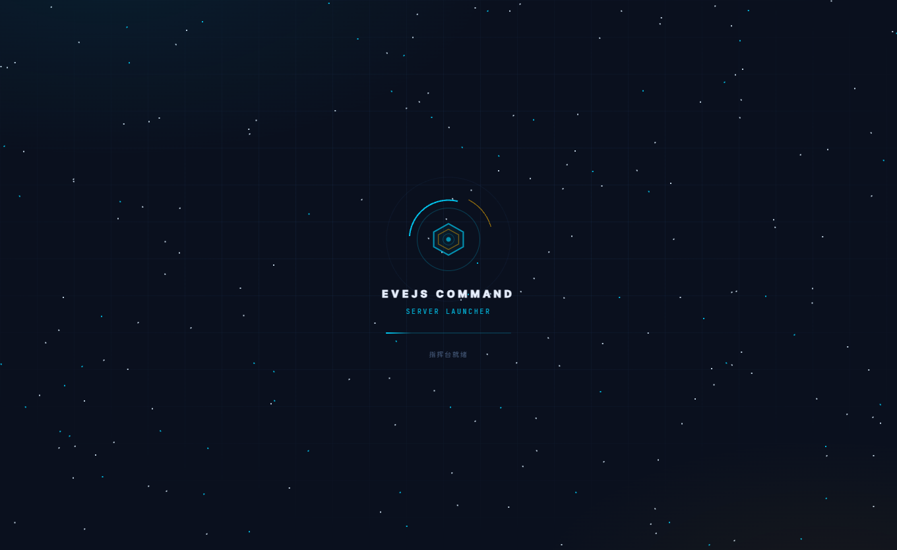
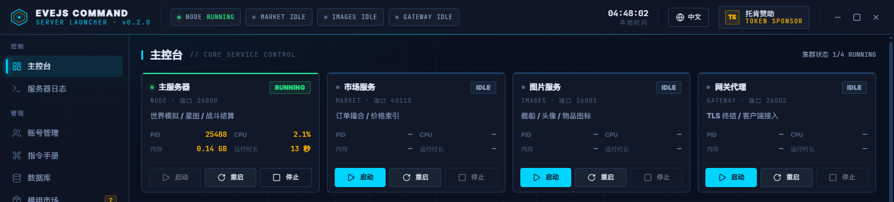
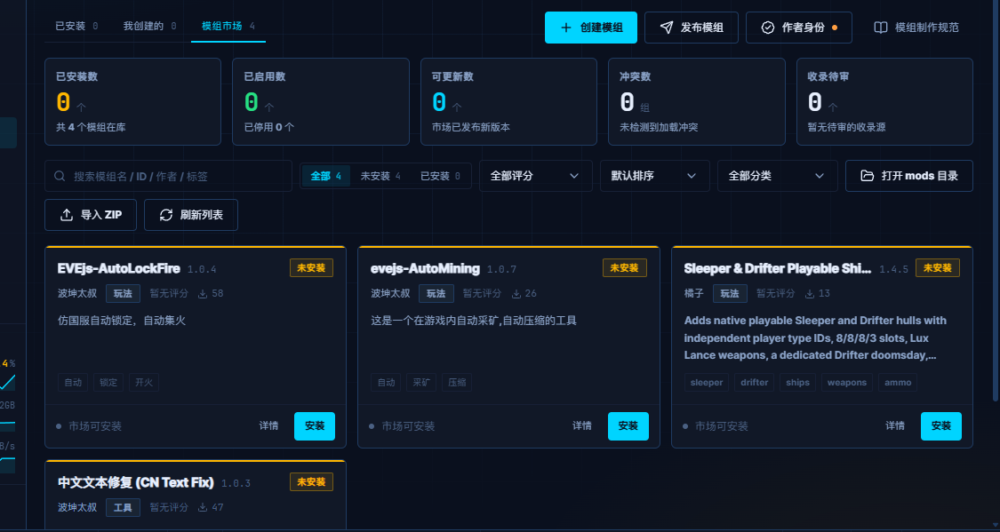

# EvEJS Launcher · EVEJS COMMAND


EvEJS Server Launcher 。



> This repository's `main` is the **0.2.6 brand-new framework version**: the shell has been changed from Electron to **Tauri 2 (Rust + system WebView2)**，
> Redo the interface using **React + shadcn/ui**。
> The old Electron version source code has been removed from `main`, but it can still be accessed via tags `v0.1.6` … `v0.1.28` and
> [Releases](https://github.com/diguo520/EVEjs-launcher/releases) 取得。

---

## English

**EvEJS Launcher (EVEJS COMMAND)** is the all-in-one desktop launcher for an EvEJS game server.

### Highlights of the 0.2.0 rewrite

- **Tauri 2 shell (Rust + system WebView2)** instead of Electron — no bundled Chromium, no bundled Node runtime.
  Portable zip ≈ 5.5 MB, installer ≈ 4.3 MB, main executable ≈ 7.3 MB.
- **React + shadcn/ui** interface with a full dark console look, localised into eight languages (Chinese, English, Japanese, Korean, French, German, Dutch, Russian) and defaulting to the system language.
- **three.js boot animation** with a silent CSS fallback when WebGL is unavailable.
- **Feature parity** with the 0.1.28 Electron build: service control, live logs, accounts and characters,
  command manual, database browser, mod marketplace / authoring / signing / publishing, config center,
  environment self-check, and self-update with Ed25519-signed manifests.




### Download

Grab the latest from [Releases](https://github.com/diguo520/EVEjs-launcher/releases):
`...-portable.zip` (green/portable, recommended) or `...-setup.exe` (NSIS installer).

Requirements: Windows 10 1809+ / Windows 11, x64, and the Microsoft Edge WebView2 Runtime
(bundled with Windows 11).

### Migrating from the Electron build

Your author identity and GitHub token carry over automatically — nothing to re-enter.
The new shell imports `author.json`, `mod-keys/<keyId>.key`, `github-token.bin` and `launcher-settings.json`
from the legacy `_launcher/data` directory (see `src-tauri/src/legacy.rs`).

### Build from source

Requires Node.js ≥ 20, Rust 1.98 (`rust-toolchain.toml` pins the channel), VS C++ Build Tools,
and a Go toolchain for the updater helper (optional if `vendor/updater/bin/evejs-updater.exe` is present).

```powershell
npm --prefix ui install
pwsh -File scripts/build.ps1
pwsh -File scripts/package.ps1 -Nsis
```

### ⚠️ Release guardrail

The legacy Electron 0.1.28 updater reads `releases/latest/download/update-manifest.json` and verifies
**sha256 only — it does not understand zip packages**. If `releases/latest` ever served a Tauri
manifest, it would replace existing users' executables with zip bytes.

The two channels are separated, and must stay that way:

| Channel | Address | Who reads it |
| --- | --- | --- |
| Tauri (this shell) | `releases/download/stable/update-manifest.json` | built into `DEFAULT_MANIFEST_URL` |
| legacy Electron | `releases/latest/download/update-manifest.json` | Electron 0.1.x only, pinned to `v0.1.28` |

After packaging a release:

```bash
node scripts/release-channel.mjs publish --version X.Y.Z   # push the new manifest to the rolling `stable` release
node scripts/release-channel.mjs verify  --version X.Y.Z   # fail loudly if `latest` ever serves our manifest
node scripts/release-channel.mjs status                    # channel status at any time
```

`scripts/audit-security.mjs` (part of `npm run check`) rejects any commit that points the built-in
manifest URL back at `releases/latest`.

### License

[GNU General Public License v3.0](LICENSE). Third-party dependencies keep their own licenses.

---

## 中文

### 这是什么

EVEJS COMMAND 是 EvEJS 服务端的一体化桌面启动器：启停四个服务（主服务器 / 市场服务 / 图片服务 / 网关代理）、
看实时日志、管账号与角色、查指令手册与数据库、创建与发布模组、检查运行环境，并支持自更新与多语言界面。

### 特性

| 模块 | 说明 |
| --- | --- |
| 主控台 | 四个服务的启停 / 重启、PID · CPU · 内存 · 运行时长实时读数、一键启动（环境自检未放行时会被挡住并给出修复指引） |
| 服务器日志 | 实时日志 + 会话概览 + 链路读数，按服务分 tab，支持过滤与自动滚动 |
| 账号与角色 | 创建账号、管理角色、发放权限、批量操作 |
| 指令手册 | 内置指令 / 物品 / NPC / QA / 模板数据，可离线检索 |
| 数据库 | 表浏览、结构视图、行检查、路径切换 |
| 模组生态 | 模组市场（拉取市场清单、一键安装）、本地模组列表与加载顺序、创建模组（脚手架）、作者身份与签名、发布 / 提交模组 |
| 配置中心 | server / market / images / gateway 配置项分组编辑，带影响提示 |
| 环境自检 | Node.js、Rust/Cargo、VS++ 构建工具、服务端依赖、数据库、市场服务二进制、客户端路径、客户端证书 CA 等逐项检测 + 修复指引 |
| 自更新 | 读取 GitHub Releases 的 `update-manifest.json`，Ed25519 签名校验后替换主程序 |
| 界面 | 深色控制台风格，three.js 启动动画（拿不到 WebGL 时静默退回 CSS 层）；界面语言支持中文 / 英语 / 日语 / 韩语 / 法语 / 德语 / 荷兰语 / 俄语，默认跟随系统语言 |

### 下载

到 [Releases](https://github.com/diguo520/EVEjs-launcher/releases) 下载：

- `EvEJSLauncher-Tauri-<版本>-portable.zip` —— 绿色便携版，解压即用（**推荐**）
- `EvEJSLauncher-Tauri-<版本>-setup.exe` —— NSIS 安装包

0.2.0 体积（本机实测）：便携 zip ≈ 5.5 MB、安装包 ≈ 4.3 MB、主程序 exe ≈ 7.3 MB。
体积门禁：exe ≤ 12 MB、zip ≤ 20 MB。

### 系统要求

- Windows 10 1809+ / Windows 11，64 位
- **Microsoft Edge WebView2 Runtime**（Windows 11 自带；Windows 10 若缺失，启动器会弹出引导安装页）
- 不再需要随包分发 Chromium / Node 运行时 —— 界面跑在系统 WebView2 里

### 从旧版（Electron 0.1.x）迁移

**不需要重置作者身份 key，也不需要重填 GitHub 令牌。**

新版启动器会把老版的数据目录接管过来（`src-tauri/src/legacy.rs`）：

| 老版文件 | 位置 | 新版行为 |
| --- | --- | --- |
| `author.json` | `_launcher/data/` | 作者身份（id / keyId / publicKey / 私钥路径）整体接管 |
| `mod-keys/<keyId>.key` | `_launcher/data/` | 私钥直接沿用（老版明文 PEM，新版可读），之后用 DPAPI 重新包裹存储 |
| `github-token.bin` | `_launcher/data/` | 从老版的 OSCrypt 密钥解出，再用 DPAPI 包一层存进 `data/os-crypt-key.bin` |
| `launcher-settings.json` | `_launcher/data/` | 设置项沿用 |

两边天然共用 `_launcher/data`，所以**把新版放到老版同一目录下时什么都不用做**；
只有把新版放到别处、`_launcher/data` 还是空的时候，才会从老启动器数据目录首次接管一份过来。

### 从源码构建

前置：Node.js ≥ 20、Rust 1.98（`rust-toolchain.toml` 已固定通道）、VS C++ 构建工具、
Go 工具链（自更新器 `vendor/updater` 需要；若 `vendor/updater/bin/evejs-updater.exe` 已存在则可省）。

```powershell
npm --prefix ui install          # 界面依赖
pwsh -File scripts/build.ps1     # 门禁 + 构建（-SkipHeavy 可跳过重档测试）
pwsh -File scripts/package.ps1 -Nsis   # 出包：便携 zip + 安装包 + update-manifest.json
```

构建产物全部落在 `artifacts/`（已 gitignore）。

### 目录结构

```
src-tauri/        Rust 外壳（服务管理、IPC、模组、签名、更新器、旧数据接管）
ui/               React + shadcn/ui 界面（编译期嵌入 exe）；ui/web/ 是随包分发的静态资源
vendor/           随包分发的 Node 侧车 CLI 与 Go 自更新器源码
contract/         IPC 契约与固定向量（83 条通道：invoke 77 + send 6）
tests/            parity / e2e / 契约与安全检查
scripts/          构建、打包、门禁、发布演练脚本
docs/screenshots/ README 用图
```

> 界面原型工程（`assets/`）与各阶段实施记录（`docs/*.md`）是维护者本地资料，**不入库**。

### 测试与门禁

```powershell
npm run check            # 契约 + 版本一致性 + 安全审计 + 查重 + parity + 渲染层 + ui/dist 同步
npm --prefix ui test     # 界面单测（vitest）
pwsh -File scripts/build.ps1            # 全量门禁（含真机 IPC 冒烟、进程残留、升级回滚演练）
pwsh -File scripts/smoke-ipc.ps1        # 真实 WebView2 上的通道自检
```

### 维护者须知：发布通道隔离

现役 **Electron 0.1.28** 的自动更新器读的是 `releases/latest/download/update-manifest.json`，
而且**只校验 sha256、不认 zip** —— `releases/latest` 一旦指向 Tauri 的 zip 清单，
老用户的主程序就会被 zip 字节替换而报废。

双轨**已经落地，不要退回**：

| 通道 | 地址 | 谁在读 |
| --- | --- | --- |
| Tauri（本外壳） | `releases/download/stable/update-manifest.json` | 编译进 `DEFAULT_MANIFEST_URL` |
| 旧 Electron | `releases/latest/download/update-manifest.json` | 仅 Electron 0.1.x，由 `make_latest` 钉在 `v0.1.28` |

发完版本后执行：

```bash
node scripts/release-channel.mjs publish --version X.Y.Z   # 把新清单推到滚动 `stable` release
node scripts/release-channel.mjs verify  --version X.Y.Z   # 核对双轨；latest 一旦下发我们的签名清单就报错
node scripts/release-channel.mjs status                    # 随时查看通道状态
```

护栏：`scripts/audit-security.mjs` 会拒绝任何把内置清单地址改回 `releases/latest` 的提交
（`npm run check` / CI 直接红）。

### 许可证

[GNU General Public License v3.0](LICENSE)（GPL-3.0）。第三方依赖各自遵循其原许可证。

---

**作者 / Author**：波坤太叔（B站）· [@diguo520](https://github.com/diguo520)（GitHub）
