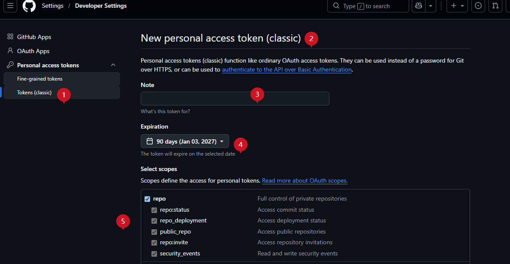

# Tutoriel de création de mods EveJS (point de vue de l'auteur)

> Pour ceux qui **veulent créer un mod** : de zéro à un mod installable depuis le marché des mods, en **8 étapes**.
> Aucune modification des fichiers du serveur n'est nécessaire — les mods sont montés via le loader.

**Ce qu'il vous faut** : Windows 10+, un serveur EveJS (0.12.8 ou plus récent), le lanceur EvEJS 0.1.20+ et un compte GitHub.

---

## 🎨 Légende des couleurs / marqueurs (à lire en premier)

| Marqueur | Signification | Ce que vous devez faire |
| --- | --- | --- |
| 🟥 **Danger** | Échec, erreur, ou conséquence **irréversible** | Ne le faites surtout pas |
| 🟨 **Attention** | Erreur facile, ou résultat différent de l'attendu | Vérifiez avant d'agir |
| 🟦 **Astuce** | Petit truc qui fait gagner du temps | Utilisable |
| 🟩 **Recommandé** | Il vaut mieux suivre cette voie | Suivez-la |
| ✅ **Obligatoire** | Sans cela, impossible d'avancer | À faire absolument |
| ⭕ **Facultatif** | Peut rester vide | Selon vos besoins |
| 🧩 **Exemple** | Code / configuration à copier tel quel | Copiez et adaptez |

> Le Markdown de GitHub, l'aperçu VS Code, Typora, etc. affichent correctement ces marqueurs colorés (ce sont des emoji, **aucune extension n'est nécessaire**).

---

## 📋 Aperçu des étapes

| # | Étape | Où | Durée approximative | Obligatoire ? |
| --- | --- | --- | --- | --- |
| 1 | Vérifier l'environnement (version / dossier mods) | Lanceur | 2 minutes | ✅ |
| 2 | Créer l'**identité d'auteur** et exporter `.eve-key` | Lanceur | 2 minutes | ✅ |
| 3 | Créer un **jeton GitHub** (classic, cocher public_repo) | Site GitHub | 5 minutes | ✅ (nécessaire pour publier et soumettre) |
| 4 | **Créer le mod** (générer le squelette) | Lanceur | 3 minutes | ✅ |
| 5 | Écrire votre logique (`loader.js`) | Éditeur | Selon le besoin | ✅ |
| 6 | Test local (activer / lire les journaux) | Lanceur | 5 minutes | 🟩 Recommandé |
| 7 | **Publier et mettre sur le marché** (empaqueter → pousser votre dépôt → ouvrir la PR de révision, en un clic) | Lanceur | 1 minute | ✅ |
| 8 | Publier une nouvelle version (changer le numéro → recliquer sur « publier ») | Lanceur | 1 minute | 🟩 Recommandé |

> 🟦 **Une seule fois vs à chaque fois** : les étapes 1 à 4 ne se font qu'une fois ; ensuite, chaque version ne passe que par l'**étape 7** (empaquetage, push du dépôt et PR de révision faits d'un coup, voir la troisième partie).

---

# Première partie : préparation (une seule fois)

## Étape 1 ✅ Vérifier l'environnement

1. Ouvrez le lanceur → **auto-vérification de l'environnement** : 9 points (Node.js / dépendances / chemin du client, etc.) ; réglez d'abord ceux qui sont rouges.
2. Vérifiez la racine du serveur EveJS (contenant `server/`, `config/`). Lanceur → **centre de configuration** affiche le chemin utilisé.
3. Vérifiez que le dossier **`mods/`** existe. Sinon, dans Mods / plugins → **créer mods/ automatiquement**.

🟨 **Attention** : le dossier des mods est fixe : `<racine EveJS>/mods/<identifiant du mod>/`. **Ne le placez pas** ailleurs et ne le renommez pas en caractères non ASCII.

---

## Étape 2 ✅ Créer l'identité d'auteur (la preuve de « qui vous êtes »)

Mods / plugins → en haut, **configuration du jeton** (identité d'auteur et jeton GitHub dans la même fenêtre) :

1. **À la première ouverture, votre paire de clés Ed25519 est générée automatiquement** (aucun bouton à cliquer)
2. Modifiez la **signature** (le nom visible, par exemple « Commandant ») → cliquez sur **enregistrer la signature**
3. Cliquez sur **exporter la clé** → enregistrez le fichier `.eve-key` **dans un endroit sûr** (clé USB / gestionnaire de mots de passe)
4. Pour changer d'ordinateur : sur la nouvelle machine, cliquez sur **importer la clé** et choisissez ce `.eve-key` ; l'identité est restaurée
5. Le bouton **dossier des clés** ouvre directement le dossier de la clé privée (`_launcher/data/mod-keys/`)

Vous obtenez trois choses :

| Élément | Description | À conserver ? |
| --- | --- | --- |
| **Identifiant d'auteur** (`au-...`) | Écrit dans le manifeste du mod, il signifie « ce mod est de vous » | Écrit automatiquement dans le manifeste |
| **Empreinte de clé** (`keyId`, 12 caractères) | Sert à vérifier la signature | Écrite automatiquement dans le manifeste |
| **Fichier `.eve-key`** | Contient la **clé privée** | 🟥 **À conserver impérativement** |

🟥 **Danger** :
- **`.eve-key` est votre identité.** Si vous le perdez → vous ne pourrez **plus jamais signer de mise à jour** (les anciens utilisateurs verront « échec de signature ») ; s'il fuite → quelqu'un peut publier à votre place.
- **Ne committez jamais** `.eve-key` ni `_launcher/data/mod-keys/*.key` sur GitHub, ne les envoyez à personne, ne les mettez pas dans un ZIP.

🟩 **Recommandé** : pour changer d'ordinateur, réimportez le `.eve-key` via « importer la clé » ; l'identité est restaurée.

---

## Étape 3 ✅ Créer un jeton GitHub (nécessaire pour publier et soumettre)

Le lanceur agit sur GitHub à votre place : à la **publication**, il écrit des fichiers dans votre propre dépôt, crée une Release et y téléverse le ZIP ; à la **demande de référencement**, il crée un fork du dépôt d'index `diguo520/EVEjs-mods` (détenu par le mainteneur) et ouvre une PR. Un **jeton classic** couvre les deux.

### 3.1 Ouvrir la bonne page 🟨

```
GitHub, avatar en haut à droite → Settings → tout en bas de la colonne de gauche, Developer settings
  → Personal access tokens → Tokens (classic) → Generate new token (classic)
```

Suivez l'image ci-dessous (les numéros correspondent aux cercles rouges de la page) :



| N° | Où cliquer / quoi saisir |
| --- | --- |
| ① | Colonne de gauche **Tokens (classic)** — pas « Fine-grained tokens » juste au-dessus |
| ② | **Generate new token** → **Generate new token (classic)** |
| ③ | **Note** : au choix, par exemple `evejs-launcher` |
| ④ | **Expiration** : 90 jours conseillés (à régénérer à l'expiration) |
| ⑤ | Dans **Select scopes**, cochez **repo** (`public_repo` en est un sous-élément ; cocher repo le couvre) |

🟥 **N'utilisez pas de jeton fine-grained** : son « Repository access » ne permet de cocher que les dépôts sur lesquels vous avez déjà des droits, pas le dépôt d'index `EVEjs-mods` détenu par le mainteneur ; or créer un fork et ouvrir une PR exige des droits d'écriture sur ce dépôt. Avec un jeton fine-grained, la soumission échouera forcément avec `403 Resource not accessible by personal access token`.

### 3.2 Remplir les informations de base

| Champ | Quoi saisir |
| --- | --- |
| Note | Au choix, par exemple `evejs-launcher` |
| Expiration | 90 jours conseillés ou personnalisé (à régénérer après expiration) |

### 3.3 Cocher les scopes (l'essentiel) 🟨

| scope | À cocher ? | Rôle |
| --- | --- | --- |
| **public_repo** | 🟩 Obligatoire | Lecture / écriture des dépôts publics : publier une Release, téléverser le ZIP, créer un fork, ouvrir une PR |
| **repo** | 🟨 Conseillé | Inclut public_repo ; à cocher si vous voulez aussi que le lanceur crée des dépôts / gère des dépôts privés |

### 3.4 Générer et copier

Cliquez sur **Generate token** → copiez la chaîne `ghp_...` (🟨 **affichée une seule fois** : elle disparaît dès que vous fermez la page).

### 3.5 Saisir dans le lanceur

Mods / plugins → **configuration du jeton** → trouvez le jeton GitHub → collez → cliquez sur **enregistrer** (chiffré en local ; les droits sont vérifiés automatiquement après l'enregistrement) → validation OK.

> 🟦 **Pourquoi passer au classic ?** Le dépôt d'index appartient au mainteneur et un jeton fine-grained ne peut pas y accéder. Seules les personnes ajoutées comme **collaborateur du dépôt d'index** peuvent utiliser un jeton fine-grained : cochez `EVEJS-mods` dans Repository access, puis **Contents = Read and write** et **Pull requests = Read and write**.

🟨 **Attention** : après avoir modifié les scopes ou régénéré un jeton, **recollez et réenregistrez** le nouveau jeton.

---

# Deuxième partie : créer un mod

## Étape 4 ✅ Créer le mod (générer le squelette)

Mods / plugins → **créer un mod**, remplissez le formulaire :

| Champ | Obligatoire | Description |
| --- | --- | --- |
| Modèle | ✅ | `Welcome Broadcast (Example)` (exemple avec un message d'accueil à la connexion) / `Blank Skeleton` (squelette vide). 🟩 Pour un premier essai, partez de l'exemple |
| Nom du mod | ✅ | Le nom affiché aux joueurs |
| Identifiant (id / nom de dossier) | 🟩 | Généré automatiquement à partir du nom ; seuls `a-z 0-9 - _ .` sont autorisés ; **ne le changez plus** après création |
| Version | ✅ | `1.0.0` par défaut ; une nouvelle version doit **s'incrémenter** (voir étape 8) |
| Catégorie | ✅ | Gameplay / Économie / IA / Graphismes / Outils (sert de filtre au marché) |
| Tags | ⭕ | Séparés par des virgules, par exemple `chat, débutant` |
| Description | 🟩 | Une phrase, affichée sur la carte du marché |
| Description détaillée / points clés | ⭕ | Écrits dans le README de votre mod |
| Ids des mods associés | ⭕ | À quels mods il est associé, séparés par une virgule ou un espace |
| Options de build | — | ☑ redémarrer le serveur (actif par défaut), ☑ activer juste après la création (actif par défaut), ☑ signer juste après la création (actif par défaut) |

Après avoir cliqué sur **créer**, votre dossier `mods/` contient en plus :

```
mods/<id de votre mod>/
├─ evejs-launcher.mod.json    ← manifeste (identité, version, catégorie, dépendances)
├─ loader.js                  ← la logique que vous écrivez
├─ README.md                  ← généré depuis « description détaillée »
└─ CHANGELOG.md               ← historique des versions
```

🟨 Ce n'est qu'en **décochant** « activer juste après la création » que `loader.js` devient `loader.js.disabled` (coché par défaut, donc chargeable par défaut). Pour changer ensuite, utilisez l'interrupteur de l'onglet **installés** — il ne fait que renommer le fichier.

🟨 **Champs obligatoires du manifeste** (le lanceur les vérifie ; sinon « échec de validation du manifeste ») :

```
schemaVersion: 3                       ← doit valoir 3
id / displayName / version             ← identifiant / nom / version
kind: "loader"                         ← seul loader peut réellement être activé
restart: "game_server"                 ← none | client | game_server | launcher
activation.strategy: "loader_rename"   ← obligatoire
le dossier doit contenir loader.js ou loader.js.disabled
```

---

## Étape 5 ✅ Écrire votre logique (`loader.js`)

Ouvrez `mods/<id de votre mod>/loader.js` : un squelette est déjà présent — 🟩 **ce squelette est un exemple minimal qui fonctionne** (le joueur reçoit un message dans le chat local 10 secondes après sa connexion). Modifiez-le à votre guise.

🟥 **Quatre règles strictes** (toutes écrites dans le squelette ; en supprimer une casse quelque chose) :

| Règle | Pourquoi |
| --- | --- |
| `setImmediate` + vérification de l'entrée (`process.env.EVEJS_GAMESTORE_OWNER_ROLE === "world"`, ou l'entrée est `index.js`) | `NODE_OPTIONS` est hérité de npm jusqu'au serveur, couche par couche : chaque processus d'enveloppe charge votre fichier ; sans vérification, votre code s'exécute dans le mauvais processus |
| **Ne pas `require` directement les gros modules du serveur** (`chatHub` charge environ 456 Mo / 645 modules) | Attendez qu'il apparaisse dans `require.cache` pour en prendre la référence : cache touché, zéro mémoire supplémentaire |
| `timer.unref()` | Empêche le minuteur de retenir le processus à la sortie |
| Utiliser `globalThis.__xxx` pour « n'installer qu'une fois » | Le loader est chargé plusieurs fois, sinon messages dupliqués et écouteurs empilés |

🟨 **Règle de chemin (le piège le plus courant)** : dans le loader, `require("./src/...")` est résolu **relativement à VOTRE dossier de mod**, **pas** à la racine du serveur — écrit ainsi, vous obtiendrez `MODULE_NOT_FOUND`. La bonne méthode consiste à calculer d'abord la racine du serveur :

```js
const path = require("path");
const serverRoot = path.resolve(__dirname, "..", "..", "server");
const hubPath = path.join(serverRoot, "src", "services", "chat", "chatHub.js");
// 🟨 Ne le require pas ici — attendez que le serveur l'ait chargé, exemple complet en annexe B
```

🟨 **Attributs de session** : les attributs personnalisés d'une session de chat **ne se synchronisent pas automatiquement** ; les lire ou les écrire directement peut « échouer en silence ». Passez par les interfaces fournies par `chatHub` / `sessionRegistry`.

🟩 Les mods qui doivent **modifier le code du serveur** (et pas seulement appeler des API) sont traités en **annexe G** — ne bridez pas vous-même `Module.prototype._compile`.

---

## Étape 6 🟩 Test local

1. Mods / plugins → **installés** → trouvez votre mod → activez l'interrupteur (ou cochez « activer immédiatement » à la création)
2. Lanceur → console → **démarrage en un clic** (démarre le serveur principal et le service de marché)
3. Lancez le jeu pour vérifier l'effet
4. En cas de problème, regardez deux journaux :
   - Lanceur → **journal du serveur** (filtrable par Système / serveur principal / service de marché / client et par INFO/WARN/ERROR)
   - Sortie de la console du serveur (visible dans le lanceur)
5. 🟩 **Vérifier « est-ce bien chargé, et en combien de temps »** : cherchez `[EveJS-MOD]` dans la sortie du serveur :
   - `loader prêt <votre mod> 3ms` — votre loader a été chargé ; `loader échec ... :: <raison>` signifie qu'il n'a pas été chargé
   - `loaders-done total=14 failed=0 ms=1086` — durée totale de chargement de tous les mods
   - `<fichier> injection de N couches (A -> B octets)` — le patch du bus a pris effet
   - `<id> échec du patch, résultat de la couche précédente conservé : <raison>` — cette couche a été ignorée (**sans** impact sur les autres mods)

   🟨 Le détail par processus et par couche est aussi écrit dans `_launcher/logs/mod-load-report.json` : consultez-le pour savoir « qui a modifié le fichier ».

### 🔧 Aide au dépannage

| Symptôme | Cause la plus probable |
| --- | --- |
| « loader.js manquant » dans la liste | Le fichier a été supprimé ou renommé |
| L'interrupteur s'éteint tout seul | Échec de validation du manifeste / signature modifiée → voir l'avertissement rouge sur la carte |
| Pas de « chargement du mod » dans le journal | Le mod est **désactivé**, ou ignoré à cause d'un conflit |
| `MODULE_NOT_FOUND` dans le journal | `require("./src/...")` a été résolu par rapport à la racine du serveur — en réalité il est relatif à votre dossier de mod (voir étape 5) |
| Aucun effet en jeu, aucune erreur | La logique fait `return` avant la vérification « n'installer qu'une fois », ou le chemin `require` est erroné |
| Mémoire Node qui explose | `require` d'un gros module du serveur (piège 2 de l'étape 5) |

---

# Troisième partie : publier sur le marché

> **Publier, c'est un clic** : le lanceur enchaîne « re-signer → empaqueter le ZIP → pousser vers votre dépôt (créer le dépôt, la Release et téléverser le ZIP si besoin) → ouvrir une PR de révision vers le dépôt d'index », et vous ne suivez que la barre de progression.
> La PR vers le dépôt d'index est **créée à chaque version** — c'est une fois fusionnée que le marché bascule sur la nouvelle version.

## Étape 7 ✅ Publier et mettre sur le marché (un clic)

Mods / plugins → **publier le mod** (les boutons « soumettre à la révision / resoumettre » de la carte « mes créations » ouvrent la même fenêtre) :

1. **Choisir le mod** : la liste déroulante **n'affiche que vos propres mods** (ceux des autres n'apparaissent pas, pour éviter les envois par erreur)
2. Remplissez le **numéro de version** et les **notes de version** (elles partent dans l'index et la PR ; écrivez simplement)
3. Vérifiez **catégorie / tags** ; **dépôt source / URL du projet** ⭕ facultatif (par exemple `https://github.com/vous/votre-mod`), **lien direct GitHub Releases** ⭕ laissez vide (l'adresse correcte est générée à la publication)
4. Cochez les trois déclarations (œuvre originale / pas de code malveillant / règles et conditions lues)
5. Cliquez sur **publier**

Le bouton « publier » ne s'active que si les prérequis en haut de la fenêtre sont remplis : **signature** (étape 2), **jeton GitHub** (étape 3), **30 minutes entre deux envois du même mod**, **60 secondes entre deux publications**. Pour chaque manque, la ligne concernée s'affiche en jaune avec un raccourci pour la compléter.

### Les quatre phases de la progression

| Phase | Ce qu'elle fait | Où |
| --- | --- | --- |
| Empaquetage local du paquet | Re-signer → empaqueter le ZIP → calculer le SHA256 → générer le manifeste du marché | **En local uniquement** : pas de réseau, pas de jeton |
| Préparation de votre dépôt source | Crée un dépôt public s'il n'existe pas | Votre GitHub |
| Publication de la Release et envoi du paquet | Écrit `evejs-mod.json` (ce que lit le marché) → crée la Release (tag = `v<version>`) → téléverse `<id>-<version>.zip` | Votre GitHub |
| Ouverture de la PR de révision | Ouvre une PR vers le dépôt d'index : un `sources.json` supplémentaire la première fois (enregistrement), puis seulement `mods/<id>.json` à chaque version | Dépôt d'index `diguo520/EVEjs-mods` |

Artefacts et registre :

| Artefact | Emplacement |
| --- | --- |
| Paquet ZIP | `_launcher/temp/export-<id>-<version>.zip` (le même est envoyé dans votre Release) |
| Registre des envois | `_launcher/data/my-submissions.json` |

🟨 **Après un changement de code, recliquez sur « publier »** : dès que le contenu change, la signature est invalidée ; le lanceur re-signe, ré-empaquette et pousse une nouvelle version.

### 🔧 Erreurs fréquentes à cette étape

| Erreur | Cause | Solution |
| --- | --- | --- |
| 🟥 `403 Resource not accessible by personal access token` | Jeton fine-grained, ou classic sans public_repo | Utilisez un jeton classic avec **public_repo** ; le dépôt d'index appartient au mainteneur, un jeton fine-grained ne l'atteint pas. Si vous êtes déjà collaborateur du dépôt d'index : jeton fine-grained avec `EVEjs-mods` + Contents / Pull requests = Read and write |
| 🟥 `net::ERR_INVALID_ARGUMENT` | Bug d'envoi du ZIP dans les anciens lanceurs | Mettez à jour vers **0.1.20+** |
| 🟥 `404` | Dépôt inexistant, ou jeton sans droits dessus | Vérifiez l'orthographe owner/repo ; utilisez un jeton classic (public_repo / repo) |
| 🟥 `jeton GitHub non renseigné` | Jeton non enregistré | Revenez à l'étape 3.5 |

🟩 **Après succès** : la fenêtre affiche l'adresse du dépôt et de la Release (ouvrez-la pour vérifier que le ZIP y est) ; la carte passe en **en révision**.

### Révision et fusion

- Le mainteneur examine votre mod dans la PR (champs du manifeste, catégorie, emplacement du ZIP, numéro de version, etc.)
- **Acceptée (fusionnée)** : la CI de l'index reconstruit immédiatement, le marché passe à votre version, tous les lanceurs peuvent la trouver
- **Refusée** : le mainteneur répond dans la PR ; dans **mes créations**, la carte devient rouge avec le **motif du refus**

🟨 **Un même mod ne peut être soumis qu'une fois toutes les 30 minutes** : insister repousserait la Release et rouvrirait la même PR ; la fenêtre indique le temps restant et le bouton reste grisé jusque-là.

🟦 Après l'envoi, le lanceur **revérifie** la PR pour confirmer qu'elle a bien été ouverte, et enregistre son numéro et son état :
la carte « mes créations » affiche `en révision / fusionnée / PR fermée` (cet état n'est revérifié qu'une fois toutes les 30 minutes au maximum, pour ne pas solliciter GitHub sans arrêt).

---

## Étape 8 🟩 Publier une nouvelle version (changer le numéro → recliquer sur « publier »)

1. Changez le numéro de version : modifiez `"version"` dans `mods/<id>/evejs-launcher.mod.json` (par exemple `1.0.1`)
   🟨 Vous pouvez aussi régénérer dans **créer un mod** avec le même id — mais **ne changez pas l'id**
2. Mods / plugins → **publier le mod** → choisissez votre mod → saisissez la version et les notes → cliquez sur **publier**
   (même dépôt, nouveau tag `v1.0.1`, nouveau ZIP `<id>-1.0.1.zip` ; la même branche `release/<id>` met la PR à jour)

🟨 **Pourquoi la version doit s'incrémenter** : le marché se base sur le numéro de version pour savoir s'il y a une nouveauté ; sans incrément, les autres lanceurs ne signaleront aucune mise à jour.

🟦 **Pourquoi le nom du ZIP contient la version** : jsDelivr met en cache les références de branche jusqu'à environ 12 heures ; un nouveau nom de fichier évite le cache périmé.

---

# Quatrième partie : révision, retrait et restauration

## Comment le mainteneur examine

| Point de contrôle | Exigence |
| --- | --- |
| Propriété du dépôt | Doit être votre propre dépôt |
| Complétude du manifeste | `id` / `displayName` / `version` / `author{id,name,keyId,publicKey}` / `sizeBytes` / `sha256` (64 caractères hex) / `downloadUrls[]` |
| Emplacement du ZIP | Dans **votre propre Release** (le dépôt d'index ne stocke aucun binaire) |
| Catégorie | Une des cinq : Gameplay / Économie / IA / Graphismes / Outils |
| Règle d'attribution | `id` premier arrivé, premier servi ; `author.id` lié à la clé (changer de clé entraîne un refus) |
| Patch du code serveur | Les mods qui modifient des fichiers du serveur doivent utiliser `__evejsMods.register` (annexe G) ; brider soi-même `Module.prototype._compile` entraîne une demande de correction — plusieurs mods qui accrochent chacun leur tour se neutralisent |

## Où voir le résultat de la révision

Lanceur → Mods / plugins → **mes créations** :

| État de la carte | Signification | Ce que vous pouvez faire |
| --- | --- | --- |
| 🟩 Sur le marché | Déjà référencé | Publier une nouvelle version |
| 🟨 Mise à jour possible / local plus récent que le marché | Votre version locale est plus récente | Suivez l'étape 8 |
| 🟧 Retiré | Retiré par le mainteneur | La carte indique le **motif du retrait** ; corrigez puis cliquez sur **resoumettre à la révision** |
| 🟥 Refusé | N'a pas passé la révision | La carte indique le **motif du refus** ; corrigez puis cliquez sur **resoumettre à la révision** |
| ⬜ Local uniquement / à soumettre | Pas encore publié | Suivez l'étape 7 |

🟦 **Mes créations** n'affiche que les entrées « votre mod existe encore en local, ou reste installable depuis le marché » ; une fois le dossier local supprimé, les entrées qui ne sont plus qu'un historique de révision disparaissent (la barre de titre indique « N entrées masquées »).

---

# Annexe : points essentiels (🟥 gardez ce passage sous la main)

| # | Point | Conséquence |
| --- | --- | --- |
| 1 | 🟥 Ne soumettez pas le mod d'un autre comme le vôtre (`author.id` qui n'est pas le vôtre fait rejeter l'envoi par le processus principal) | Échec de l'envoi |
| 2 | 🟥 `.eve-key` / clé privée : jamais transmise, jamais commitée, jamais dans un ZIP | Usurpation d'identité, ou perte définitive de la capacité de mise à jour |
| 3 | 🟥 Ne modifiez pas les fichiers du serveur sur le disque | Modifier le `server/` d'autrui rend l'installation impossible / casse à la première mise à jour ; pour modifier en mémoire, passez par `__evejsMods.register` (annexe G) |
| 4 | 🟥 Ne `require` pas les gros modules du serveur dans le loader | Mémoire Node qui explose |
| 5 | 🟨 Le numéro de version ne peut qu'augmenter | Les autres ne reçoivent pas la mise à jour |
| 6 | 🟨 Après un changement de code, recliquez sur « publier » (re-signature, ré-empaquetage et push automatiques) | Signature invalidée / le marché garde l'ancien paquet |
| 7 | 🟨 Ne changez pas l'`id` après création | Chez les anciens utilisateurs, cela devient « désinstallation + nouvelle installation » |
| 8 | 🟨 Le nom du ZIP contient la version | Sinon le cache CDN peut servir un ancien paquet |
| 9 | 🟨 N'utilisez que les cinq catégories fixes | Invisible dans les filtres du marché |
| 10 | 🟦 Le loader ne s'installe qu'une fois (test `globalThis`) | Sinon enregistrements et messages dupliqués |

---

# Annexe A : table complète des champs du manifeste (`evejs-launcher.mod.json`)

| Champ | Obligatoire | Type | Description |
| --- | --- | --- | --- |
| `schemaVersion` | ✅ | number | Fixé à `3` |
| `id` | ✅ | string | Identifiant du mod, ≤128 caractères, sans séparateur de chemin, `a-z0-9-` conseillé |
| `displayName` | ✅ | string | Nom affiché, ≤100 caractères |
| `version` | ✅ | string | Numéro de version, ≤64 caractères, par exemple `1.0.0` |
| `kind` | ✅ | string | `loader` (utilisable) / `settings` / `client-package` / `source-integrated` (versions ultérieures) |
| `restart` | ✅ | string | `none` / `client` / `game_server` / `launcher` |
| `activation.strategy` | ✅ | string | `loader_rename` |
| `description` | ⭕ | string | Description, ≤1000 caractères (affichée sur la carte du marché) |
| `category` | 🟩 | string | Gameplay / Économie / IA / Graphismes / Outils |
| `tags` | ⭕ | string[] | Tags |
| `author` | ✅ | object | `{ id, name, keyId, publicKey }` (écrit automatiquement par le lanceur) |
| `requires` / `loadAfter` / `loadBefore` / `conflicts` | ⭕ | string[] | Dépendances et conflits (ids de mods) |
| `compatibility.evejsVersions` | ⭕ | string[] | Versions EveJS compatibles, par exemple `["0.12.8"]` |
| `signature` | ✅ | object | Signature (générée automatiquement par le lanceur) |

# Annexe B : un squelette de loader qui fonctionne

Voici la **version condensée** du squelette généré par « créer un mod » — les quatre règles strictes y sont toutes ; adaptez-le et il fonctionne (la version complète commentée se trouve dans `mods/<id de votre mod>/loader.js`) :

```js
"use strict";
const path = require("path");

const TAG = "[mon-mod]";
const MOD_ID = "my-mod";
const POLL_MS = 3000;
const GRACE_MS = 10000;                      // attendre ce délai après la connexion : la session doit être prête
const MESSAGE = "Bon retour, pilote !";

// Décommentez ce bloc pour modifier le code du serveur (mécanisme du bus : déclarer, ajouter seulement) :
//   target —— relatif à la racine EveJS, barres obliques
//   marker —— marqueur unique ; le bus l'ignore s'il est déjà présent (idempotent)
//   slot   —— ordre entre plusieurs couches pour un même fichier, plus petit = plus tôt (multiples de 10 conseillés)
//   append —— code ajouté uniquement, jamais de réécriture complète
const SOURCE_PATCH = null;
// const SOURCE_PATCH = {
//   target: "server/src/network/tcp/handshake.js",
//   marker: "// my-mod:patch",
//   slot: 40,
//   append: "// my-mod:patch\nconsole.log('[my-mod] patched');",
// };

console.log(TAG + " preload exécuté · pid=" + process.pid);

/** Ne continuer que dans le vrai processus serveur (exclut npm / les processus d'enveloppe) */
function isRealServerProcess() {
  if (process.env.EVEJS_GAMESTORE_OWNER_ROLE === "world") return true;
  const entry = (require.main && require.main.filename) || process.argv[1] || "";
  return /(^|[\\/])index\.js$/i.test(entry);
}

/** Enregistrer le patch de code sur le bus d'injection (🟥 doit s'exécuter de façon synchrone, voir ci-dessous) */
function registerSourcePatch() {
  if (!SOURCE_PATCH || !SOURCE_PATCH.target) return;
  const bus = globalThis.__evejsMods;
  if (!bus || !(Number(bus.api) >= 1)) {
    console.log(TAG + " ancien lanceur sans bus d'injection, patch de code ignoré");
    return;
  }
  bus.register({
    id: MOD_ID,
    target: SOURCE_PATCH.target,
    marker: SOURCE_PATCH.marker,
    slot: SOURCE_PATCH.slot,
    apply: (source) => source + "\n" + SOURCE_PATCH.append + "\n",
  });
}
// 🟥 Enregistrement synchrone : le serveur require les fichiers cibles dès son démarrage,
//    un enregistrement dans setImmediate arrive trop tard (le fichier est déjà compilé, le patch ne s'applique pas)
registerSourcePatch();

setImmediate(() => {
  if (!isRealServerProcess()) return;
  if (globalThis.__myModStarted) return;      // 🟨 chargé plusieurs fois : n'installer qu'une fois
  globalThis.__myModStarted = true;
  start();
});

function start() {
  // 🟥 require("./src/...") est relatif à VOTRE dossier de mod, pas à la racine du serveur — calculez d'abord la racine
  const serverRoot = path.resolve(__dirname, "..", "..", "server");
  const hubPath = path.join(serverRoot, "src", "services", "chat", "chatHub.js");
  const registryPath = path.join(serverRoot, "src", "services", "chat", "sessionRegistry.js");

  // 🟨 Attendez que le serveur ait lui-même ces deux modules dans require.cache avant de prendre la
  //    référence : cache touché, zéro mémoire supplémentaire, et pas de graphe de 456 Mo chargé trop tôt
  const timer = setInterval(() => {
    if (!require.cache[require.resolve(hubPath)]) return;
    if (!require.cache[require.resolve(registryPath)]) return;
    clearInterval(timer);
    run(require(require.resolve(hubPath)), require(require.resolve(registryPath)));
  }, 500);
  timer.unref();
}

function run(chatHub, sessionRegistry) {
  const seen = new Set();
  const firstSeenAt = new Map();

  const timer = setInterval(() => {
    let sessions;
    try {
      sessions = sessionRegistry.getSessions() || [];
    } catch {
      return;
    }

    const now = Date.now();
    const online = new Set();

    for (const session of sessions) {
      const characterID = sessionRegistry.resolveSessionCharacterID(session);
      if (!characterID) continue;              // pas encore vraiment en jeu, attendre le tour suivant
      online.add(characterID);
      if (!firstSeenAt.has(characterID)) firstSeenAt.set(characterID, now);
      if (seen.has(characterID)) continue;
      if (now - firstSeenAt.get(characterID) < GRACE_MS) continue;

      try {
        // Certains objets de session ne portent que charid en minuscules : on complète pour éviter l'« envoi silencieux »
        if (!Number(session.characterID || 0)) session.characterID = characterID;
        chatHub.sendSystemMessage(session, MESSAGE);
        seen.add(characterID);
        console.log(TAG + " message envoyé au personnage " + characterID);
      } catch (error) {
        console.log(TAG + " personnage " + characterID + " pas encore prêt, nouvel essai plus tard : " + error.message);
      }
    }

    // Nettoyer les personnages déconnectés ; ils redéclencheront à la prochaine connexion
    for (const id of Array.from(seen)) if (!online.has(id)) seen.delete(id);
    for (const id of Array.from(firstSeenAt.keys())) if (!online.has(id)) firstSeenAt.delete(id);
  }, POLL_MS);
  timer.unref();
}
```

🟨 Les interfaces serveur utilisées ci-dessus sont **vérifiées en conditions réelles** :

| Interface | Usage |
| --- | --- |
| `sessionRegistry.getSessions()` | Tableau des sessions en ligne (🟥 **pas** `list()`, cette méthode n'existe pas) |
| `sessionRegistry.resolveSessionCharacterID(session)` | Récupère l'ID du personnage (0 tant qu'il n'est pas entré en jeu) |
| `chatHub.sendSystemMessage(session, "message")` | Envoie un message système sur le canal local de ce personnage |

Les interfaces peuvent changer selon la version d'EveJS ; fiez-vous aux exports réels de votre version.

# Annexe C : conflits et ordre de chargement

| Type | Comment il apparaît | Conséquence |
| --- | --- | --- |
| Conflit déclaré | `conflicts` se citent mutuellement dans les manifestes | Les deux mods ne s'activent pas en même temps |
| `id` dupliqué | Deux manifestes partagent le même `id` | Un seul sera chargé |
| Module serveur partagé | Plusieurs loaders référencent le même module serveur | Ils peuvent s'influencer (le lanceur le signale) |
| Dépendance manquante | Le mod de `requires` n'est pas installé | Ce mod n'est pas chargé |

🟦 Ordre de chargement : dans **installés**, glissez-déposez les cartes, ou utilisez le bouton « ⤓ déplacer en dernier » en haut à gauche d'une carte. La liste est groupée avec les mods activés d'abord et les désactivés ensuite, chaque groupe dans votre ordre — désactiver un mod n'oblige à rien réordonner, et le réactiver le remet à sa place.
🟨 `loadAfter` / `loadBefore` du manifeste **sont prioritaires** et ajustent l'ordre que vous avez glissé ; un mod déplacé est marqué « déplacé par une contrainte du manifeste » dans le panneau Ordre de chargement.
🟦 Le panneau Ordre de chargement montre l'ordre **réellement appliqué**, plus les mods qui **ne seront pas chargés** cette fois (manifeste invalide / dépendance manquante / conflit / pas de loader.js) et les déclarations **sans effet** (cible absente ou désactivée, dossier disparu de l'ordre enregistré). Un redémarrage du serveur est nécessaire pour appliquer.

## 🟥 Plusieurs mods modifient le même fichier serveur (le nouveau lanceur a la solution)

Si un mod **bride lui-même `Module.prototype._compile`** pour modifier le code du serveur, deux mods sur le même fichier posent problème :

- celui qui voit le fichier original en premier dépend entièrement de l'ordre de chargement ;
- si l'un valide par le « sha256 du fichier entier », il **échouera** parce que l'autre a déjà ajouté du contenu ;
- le cas réellement observé : `minage automatique` et `verrouillage + tir automatique` ajoutaient tous deux du code à la fin de `server/src/network/tcp/handshake.js` ; le premier injecté écrivait, le second constatait un hachage différent et **abandonnait silencieusement** (ni erreur, ni effet).

🟩 Le nouveau lanceur fournit pour cela un **bus d'injection** : les mods n'accrochent plus chacun leur tour, mais déclarent via `__evejsMods.register` « quel fichier modifier, quoi ajouter », et le bus enchaîne les couches par `(slot, ordre d'enregistrement)` — chaque couche voit le contenu **déjà modifié par la précédente**. Voir l'**annexe G**.

# Annexe D : structure du ZIP et règles d'import

### Structure du ZIP (les deux sont acceptées, la seconde est recommandée)

```text
Première : manifeste à la racine    Seconde : dossier unique englobant (recommandé)
my-mod.zip                          my-mod.zip
├── evejs-launcher.mod.json          └── my-mod/
├── loader.js.disabled                   ├── evejs-launcher.mod.json
└── README.md                            ├── loader.js.disabled
                                          └── README.md
```

Le lanceur localise automatiquement la racine du paquet ; un ZIP contenant **plusieurs** paquets de mods est refusé (un seul import à la fois).

### Règles lorsque quelqu'un importe votre ZIP

| Règle | Description |
| --- | --- |
| Emplacement d'installation | `<racine EveJS>/mods/<id du manifeste>` (les caractères invalides de l'id deviennent `-`) |
| État initial | **Désactivé de force** (`loader.js` redevient `loader.js.disabled`) ; l'utilisateur l'active manuellement |
| Conflit de nom | Un dossier du même nom existe déjà sous `mods/` → import refusé avec message |
| Manifeste manquant | Pas de `evejs-launcher.mod.json` dans le ZIP → refusé |

### 🟨 Taille

La page des mods **calcule récursivement l'espace occupé par chaque mod**. N'empaquetez que les fichiers nécessaires à l'exécution — 🟥 ne mettez pas le dépôt source, `node_modules`, des captures d'écran ou `.git` dans le ZIP.

# Annexe E : comment le loader est injecté

🟩 **Aujourd'hui (via le bus d'injection)** : le lanceur ne place **qu'un seul** `--require "<mod-host.js fourni par le lanceur>"` dans `NODE_OPTIONS` ; votre `loader.js` est `require` par le bus dans l'ordre de `_launcher/mods/mod-plan.json`. Le nom du dossier de mod peut donc contenir des caractères non ASCII ou des espaces ; dans le journal du lanceur, `[EveJS-MOD] loaders-done total=N failed=0 ms=X` indique combien de millisecondes a pris le chargement de tous les mods.

🟨 **Ce qui suit est l'ancienne méthode « un `--require` par loader »** (aujourd'hui utilisée seulement comme filet de sécurité si l'écriture du plan du bus échoue) : le lanceur injecte votre `loader.js` dans le processus serveur via `NODE_OPTIONS=--require ...` de Node. Donc :

- 🟥 **Les barres obliques inverses sont prises pour des échappements** → `C:\mods\x\loader.js` devient `C:modsxloader.js`
- 🟨 `NODE_OPTIONS` se découpe sur les espaces : **un chemin contenant des espaces doit être entre guillemets**

La bonne méthode est « convertir les chemins en barres obliques + entourer de guillemets doubles » — c'est ce que fait le lanceur en interne (vérifié en conditions réelles) :

```js
const requireArgs = paths.map((p) => '--require "' + p.replace(/\\/g, "/") + '"').join(" ");
```

🟦 Vous **n'avez pas** à assembler ceci vous-même — sachez simplement qu'« un dossier de mod ne doit pas contenir de caractères non ASCII ni d'espaces », ce qui aide au dépannage.

# Annexe F : liste de contrôle avant publication

- [ ] Le mod s'active et fonctionne en local (testé à l'étape 6)
- [ ] Les mods qui modifient le code serveur passent par `__evejsMods.register` (annexe G), sans brider `_compile` eux-mêmes
- [ ] `id` / `version` / `category` sont corrects dans `evejs-launcher.mod.json`
- [ ] Le numéro de version est **supérieur au précédent**
- [ ] `.eve-key` est sauvegardé (nécessaire pour changer d'ordinateur)
- [ ] `mods/<id>/` ne contient ni clé privée, ni chemin local, ni autre information privée
- [ ] Vous avez cliqué sur **publier le mod**, les quatre phases sont passées, et le ZIP est visible sur votre page Release
- [ ] La PR de révision ouverte pour cette version dans le dépôt d'index **a été fusionnée** (sinon le marché reste sur la version précédente)


# Annexe G : modifier le code serveur — le bus d'injection `__evejsMods.register`

🟨 Seuls les mods qui **doivent modifier le code serveur** ont besoin de cette partie. Un mod comme « message d'accueil à la connexion », qui ne fait qu'appeler des API serveur, se contente de l'annexe B.

Le bus est injecté par le lanceur ; côté mod, il suffit de déclarer à la fin du fichier :

```js
const bus = globalThis.__evejsMods;
if (bus && bus.api >= 1) {
  bus.register({
    id: "id de votre mod",                          // identique à l'id du manifeste, sert de marqueur dans le rapport
    target: "server/src/network/tcp/handshake.js",  // relatif à la racine EveJS, barres obliques
    marker: "MY_MOD_MARK",                         // marqueur unique : s'il est déjà injecté, la couche est ignorée (idempotent)
    slot: 10,                                      // ordre entre plusieurs couches d'un même fichier, plus petit = plus tôt
    apply: (source) => source + "\n// MY_MOD_MARK\n// mettez ici le code à ajouter\n",
  });
} else {
  // ancien lanceur sans bus : possibilité de revenir à un hook maison, ou de ne rien injecter
}
```

Quatre règles (🟥 en violer une fait échouer d'autres mods sans raison apparente) :

| Règle | Pourquoi |
| --- | --- |
| Utiliser uniquement `register`, **ne pas** brider soi-même `Module.prototype._compile` | Accrocher son propre hook revient à « se disputer le point d'injection », et le bus ne voit plus vos modifications |
| `apply` **ajoute seulement** ; ne réécrivez pas et ne supprimez pas le contenu existant | Les couches suivantes doivent recevoir votre résultat pour continuer à ajouter |
| Choisissez un `marker` unique que personne d'autre n'utilise | Le bus s'en sert pour savoir si l'injection a déjà eu lieu ; un redémarrage n'empile donc pas les couches |
| Pour valider, vérifiez le **préfixe avant modification** (ou la longueur), pas le sha256 du fichier entier | Un hachage complet ne peut pas correspondre dans une chaîne à plusieurs couches : c'est se verrouiller soi-même |

🟩 Comment lire le résultat : dans le journal, `[EveJS-MOD] <fichier> injection de N couches (A -> B octets)` signifie que cette couche a pris effet ; `[EveJS-MOD] <id> échec du patch, résultat de la couche précédente conservé : <raison>` signifie que cette couche a été ignorée (**sans** impact sur les autres mods).

---

**Version du document** : mise à jour avec les versions du lanceur (synchronisée avec `_launcher/mods/MOD_AUTHORING.fr.md` du lanceur).
Pour un cas non couvert ici, regardez d'abord le **journal du serveur** du lanceur et les avertissements rouges sur les cartes, puis posez la question au mainteneur avec le journal.
